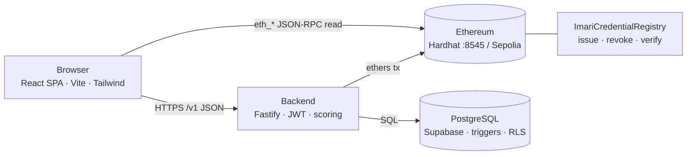

# Imari — personalised financial literacy learning platform


> Suggested CI: `.github/workflows/ci.yml` running `blockchain` tests (`npm test`), backend tests (`npm test`), and frontend typecheck/lint on every push.

Imari assesses each student's financial-literacy level, recommends modules for their weak competency domains, tracks progress, and issues **blockchain-verifiable micro-credentials** once competency criteria are met.

---

## 1. Repository layout

| Path | Description |
|---|---|
| `README.md` | This file — top-level guide (architecture, setup, file index) |
| `proposal.md` | The original project proposal document |
| `frontend/` | React 18 + TypeScript + Vite + Tailwind web client (student & admin portals) |
| `frontend/src/contexts/` | Client state (auth, platform, preferences) |
| `frontend/src/config/chain.ts` | Chain/API endpoints read from `VITE_*` env vars |
| `frontend/src/utils/verifyLive.ts` | Credential verification: backend API → direct chain read → local fallback |
| `frontend/scripts/screenshots.mjs` | Playwright script that regenerates `docs/screenshots/` |
| `frontend/public/` | Static assets |
| `backend/` | Fastify + TypeScript API service (auth, scoring, modules, credentials, admin) |
| `backend/src/app.ts` | App factory: security middleware + route registration under `/v1` |
| `backend/src/routes/` | Route modules: `auth`, `me`, `assessment`, `modules`, `credentials`, `notifications`, `admin` |
| `backend/src/lib/` | Shared helpers (DB, chain client, hashing, tokens) |
| `backend/openapi.yaml` | Full OpenAPI 3 contract for every endpoint |
| `backend/scripts/` | `migrate.ts` / `seed.ts` DB utilities |
| `backend/test/` | Node test-runner unit/integration tests |
| `database/` | Postgres schema & reference data |
| `database/migrations/0001_schema.sql` | Tables (users, invites, modules, progress, credentials, …) |
| `database/migrations/0002_indexes.sql` | Indexes |
| `database/migrations/0003_triggers.sql` | Competency/credential eligibility triggers |
| `database/migrations/0004_rls_and_views.sql` | Row-level security policies + evaluation views |
| `database/migrations/0005_auth_sessions.sql` | Refresh-token session tables |
| `database/seed/0001_reference_data.sql` | Reference rows (domains, invite codes, demo content) |
| `blockchain/` | Hardhat project: Solidity registry + local node + Sepolia deploy |
| `blockchain/contracts/ImariCredentialRegistry.sol` | `issue` · `revoke` · `reinstate` · `verify` · `get` · `setIssuer` |
| `blockchain/test/ImariCredentialRegistry.test.ts` | 8-test Hardhat suite (`npm test`) |
| `blockchain/scripts/deploy.ts` | Deployment script (localhost + Sepolia) |
| `blockchain/hardhat.config.ts` | Networks, Etherscan, TypeScript toolbox config |
| `docs/README.md` | Docs index |
| `docs/integration-guide.md` | End-to-end wiring of the four subsystems |
| `docs/blockchain-proposal-review.md` | Proposal-vs-implementation review notes |
| `docs/project-documentation.md` | Defence documentation (description, setup, designs, deployment plan) |
| `docs/screenshots/` | Application screenshots embedded in the docs |

## 2. Architecture & system topology



> 🔍 **Interactive viewer** — open [`docs/architecture-viewer.html`](docs/architecture-viewer.html) in a browser for pan / zoom / reset / fit controls (svg-pan-zoom), plus built-in zoom icons on the diagram.

<details><summary>ASCII fallback</summary>

```
┌─────────────────────────────────────────────────────────────────────────────┐
│                              BROWSER (SPA)                                  │
│  frontend/ — React 18 + TS + Vite + Tailwind                                │
│  • Student & admin portals                                                 │
│  • VITE_API_URL → backend   VITE_RPC_URL → chain (direct reads)             │
└───────────────┬───────────────────────────────────┬─────────────────────────┘
                │ HTTPS/JSON                        │ eth_* JSON-RPC (read-only)
                ▼                                   ▼
┌───────────────────────────────┐    ┌───────────────────────────────────────┐
│   backend/ (Fastify, :4000)   │    │  Ethereum node RPC                    │
│   • JWT auth (HS256)          │    │  • dev: Hardhat node :8545 (chainId   │
│   • scoring / recommendations │    │    31337)                             │
│   • credential issuing        │───►│  • prod: Sepolia (chainId 11155111)   │
│     (ethers → contract)       │ tx │                                       │
│   • events watcher            │    │  ┌─────────────────────────────────┐  │
└───────┬───────────────────────┘    │  │ ImariCredentialRegistry (Sol)  │  │
        │ SQL (pg)                   │  │  stores keccak(id), keccak     │  │
        ▼                            │  │  (contentHash), status         │  │
┌───────────────────────────────┐    │  └─────────────────────────────────┘  │
│ PostgreSQL (local / Supabase) │◄───┘ only idHash + contentHash + status    │
│ normalized app data, triggers │     leave the personal-data boundary       │
└───────────────────────────────┘
```

</details>

**Topology notes**

* The **backend owns all secrets** (JWT secret, DB, issuer key). The frontend never holds private keys.
* The **chain holds the proof** — only `keccak(credentialId)`, `contentHash` and status are written on-chain; names, scores and answers stay in Postgres.
* Public verification works two ways: `GET /v1/verify/:id` (backend reads DB + contract) or direct browser read via `ethers` from `blockchain/` artifact.

## 3. Prerequisites

| Tool | Version |
|---|---|
| Node.js | 20 LTS recommended (works on v23 with warnings) |
| npm | 10+ |
| PostgreSQL | 15+ (local Homebrew install or Supabase) |
| Git | any recent |

## 4. Setup (reproducible, step by step)

```bash
# 0. Clone
git clone https://github.com/Kodedbykenzie/project_defence.git
cd project_defence

# 1. Install dependencies per package
cd frontend   && npm install && cd ..
cd backend    && npm install && cd ..
cd blockchain && npm install && cd ..

# 2. Database (local Homebrew Postgres example)
createdb imari
psql -d imari -f database/migrations/0001_schema.sql
psql -d imari -f database/migrations/0002_indexes.sql
psql -d imari -f database/migrations/0003_triggers.sql
psql -d imari -f database/migrations/0004_rls_and_views.sql
psql -d imari -f database/migrations/0005_auth_sessions.sql
psql -d imari -f database/seed/0001_reference_data.sql
# …or: cd backend && npm run db:setup

# 3. Configure environment
cp backend/.env.example    backend/.env        # fill DATABASE_URL, JWT_SECRET, …
cp blockchain/.env.example blockchain/.env      # only needed for Sepolia
cp frontend/.env.example   frontend/.env        # VITE_API_URL=http://localhost:4000
```

## 5. Run the full stack (4 terminals)

```bash
# T1 — local blockchain
cd blockchain && npm run node

# T2 — deploy the registry (prints the contract address)
cd blockchain && npm run deploy:local
#    → copy "ImariCredentialRegistry: 0x…" into backend/.env
#      CREDENTIAL_CONTRACT_ADDRESS=0x…  and frontend/.env VITE_CONTRACT_ADDRESS

# T3 — backend API
cd backend && npm run dev          # http://localhost:4000, GET /health → {"status":"ok"}

# T4 — frontend
cd frontend && npm run dev         # http://localhost:5173
```

Demo accounts: student `aline@alustudent.com` · admin `admin@imari.rw` · password `demo1234` · invite `ALU-PILOT`.

## 6. Tests & quality

| Layer | Command | What it covers |
|---|---|---|
| Smart contract | `cd blockchain && npm test` | 8 Hardhat tests: issue, revoke, reinstate, verify-tamper, unknown-id, pause, ownership |
| Backend | `cd backend && npm test` | Node test-runner suites for scoring/auth/credentials |
| Frontend | `cd frontend && npm run typecheck` / `npm run lint` | `tsc --noEmit` + eslint |
| E2E (manual) | deploy:local then issue/verify/revoke via UI | end-to-end credential lifecycle |

Regenerate the screenshots in `docs/screenshots/` with:

```bash
cd frontend && node scripts/screenshots.mjs
```

## 7. Package scripts cheat-sheet

```bash
# frontend/
npm run dev / build / lint / typecheck / preview

# backend/
npm run dev / build / start / test / db:migrate / db:seed / db:setup

# blockchain/
npm run compile / test / node / deploy:local / deploy:sepolia
```

## 8. Further reading

- End-to-end integration: [`docs/integration-guide.md`](docs/integration-guide.md)
- Docs index: [`docs/README.md`](docs/README.md)
- Defence documentation (description, designs, deployment plan): [`docs/project-documentation.md`](docs/project-documentation.md)
- Proposal review: [`docs/blockchain-proposal-review.md`](docs/blockchain-proposal-review.md)
- Original proposal: [`proposal.md`](proposal.md)
