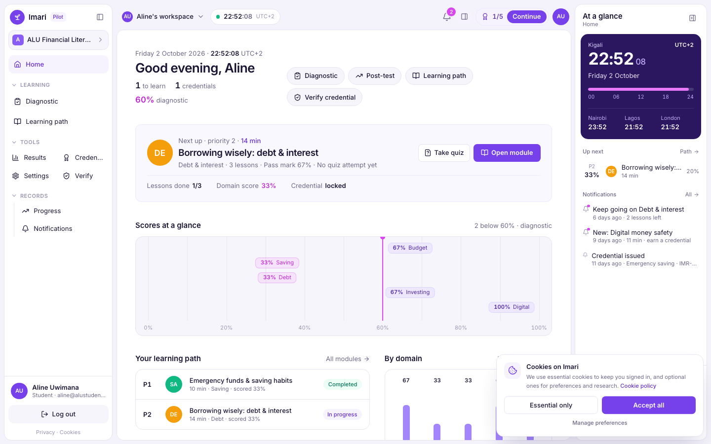
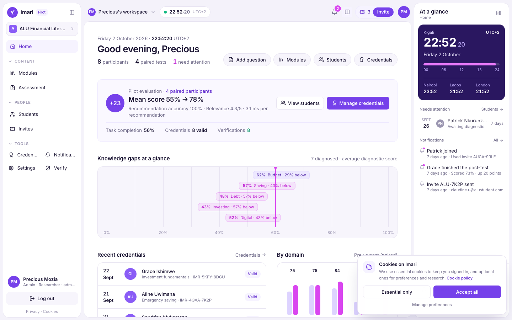
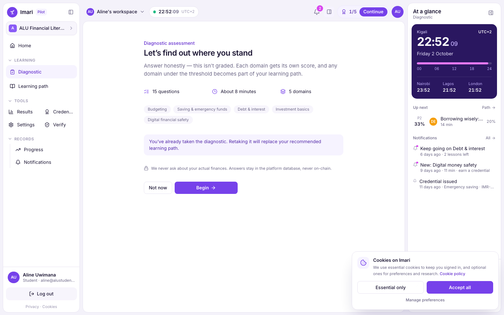
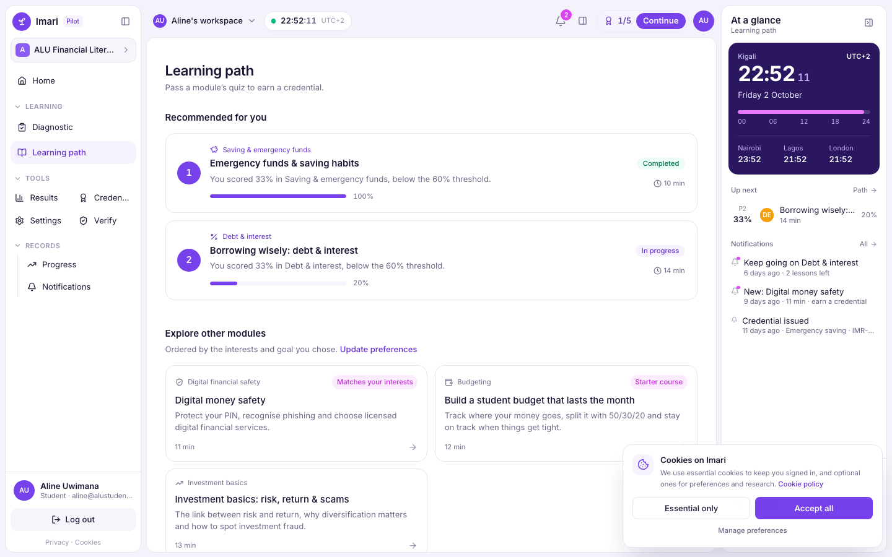
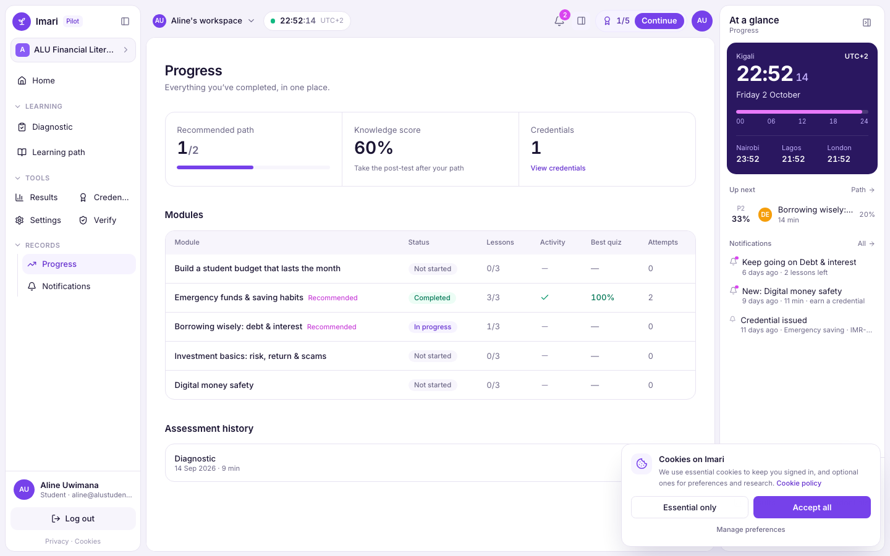
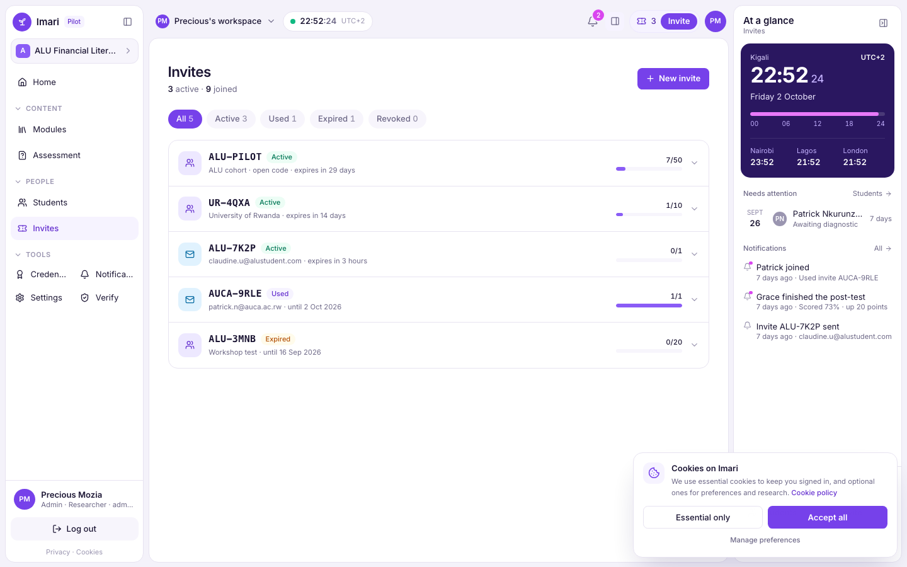
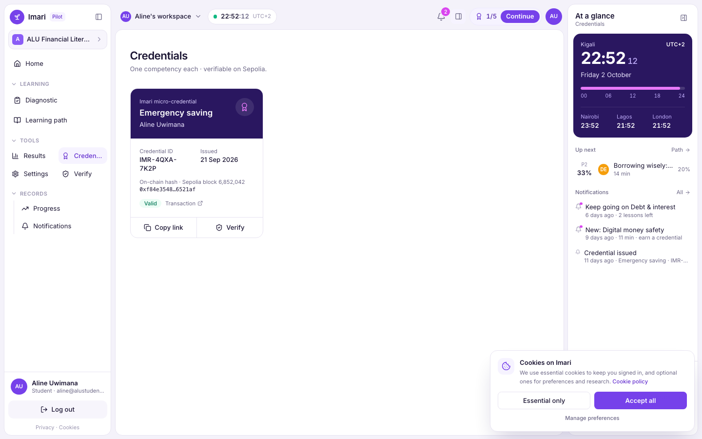
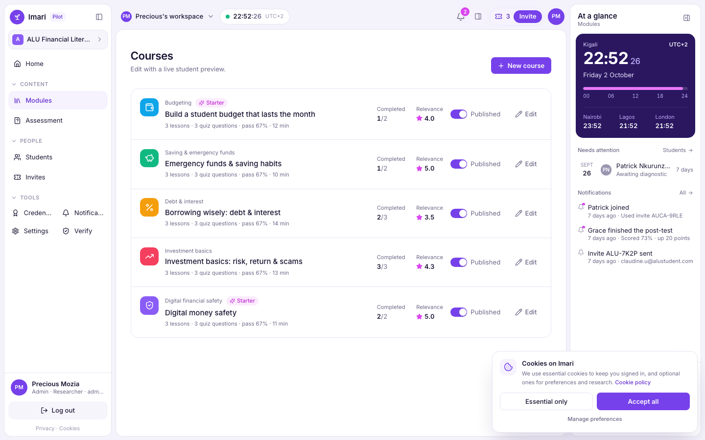
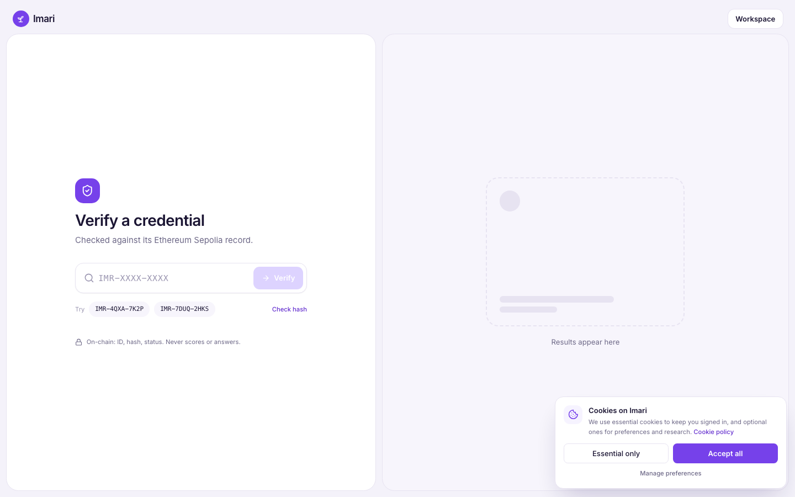

# Imari — Project Documentation

## 1. Description

**Imari** is a personalised financial-literacy learning platform designed for university students in Rwanda (pilot: ALU cohort, Kigali). Students take a diagnostic assessment, receive tailored learning modules based on their weak competency domains, track progress, and — once they master a competency — earn a verifiable micro-credential anchored on the Ethereum blockchain.

Key features:

- **Diagnostic assessment** — the backend scores attempts server-side and maps results to "weak domains".
- **Recommendation engine** — published modules in weak domains are recommended, ordered by ascending score (threshold configurable by admins, default 60).
- **Learning modules** — lessons, activities and quizzes with progress tracking.
- **Micro-credentials** — once competency criteria are met, a credential (`id hash` + `content hash` + status) is issued and its hash is anchored in the `ImariCredentialRegistry` smart contract (local Hardhat chain in dev, Sepolia testnet in production). Employers/verifiers can check authenticity at `GET /v1/verify/:credentialId`.
- **Admin console** — invites, roster, course editor, credential revocation/reinstatement (also updates on-chain status), threshold settings and evaluation metrics.

## 2. GitHub repository

https://github.com/Kodedbykenzie/project_defence

## 3. Environment setup

### Prerequisites

| Tool | Version |
|---|---|
| Node.js | 20 LTS recommended (dev has been tested on v23) |
| npm | 10+ |
| PostgreSQL | 15+ (local Homebrew install or Supabase) |
| Git | any recent |

### Clone & install

```bash
git clone https://github.com/Kodedbykenzie/project_defence.git
cd project_defence
cd frontend   && npm install
cd ../backend && npm install
cd ../blockchain && npm install
```

### Database

```bash
# Apply migrations in order, then seed reference data
psql -d imari -f database/migrations/0001_init.sql   # repeat for each migration
psql -d imari -f database/seed/0001_reference_data.sql
# or via the backend scripts:
cd backend && npm run db:setup
```

### Environment variables

- `backend/.env` — copy from `backend/.env.example`: `DATABASE_URL`, `JWT_SECRET`, `APP_ORIGIN`, `GOOGLE_CLIENT_ID` (optional), `SEPOLIA_RPC_URL`, `ISSUER_PRIVATE_KEY`, `CREDENTIAL_CONTRACT_ADDRESS`.
- `blockchain/.env` — for Sepolia deployment only: `SEPOLIA_RPC_URL`, `DEPLOYER_PRIVATE_KEY`, `ETHERSCAN_API_KEY`.
- `frontend/.env` — copy from `frontend/.env.example`: `VITE_API_URL=http://localhost:4000`, `VITE_RPC_URL`, `VITE_CONTRACT_ADDRESS`.

> For local development set `SEPOLIA_RPC_URL=http://127.0.0.1:8545` and use Hardhat account #0's private key as `ISSUER_PRIVATE_KEY`.

### Run the full stack

```bash
cd blockchain && npm run node          # terminal 1 — local chain :8545
cd blockchain && npm run deploy:local  # terminal 2 — deploy registry, copy address to backend/.env
cd backend    && npm run dev           # terminal 3 — API :4000
cd frontend   && npm run dev           # terminal 4 — UI   :5173
```

Demo accounts: student `aline@alustudent.com`, admin `admin@imari.rw`, password `demo1234`, invite `ALU-PILOT`.

## 4. Designs

- **Figma mockups** — _(insert link to your Figma file)_
- **System diagram**:

```
React + TS client ──► Backend API ──► PostgreSQL (Supabase)   ← all personal & learning data
       │                   │
       │                   └──► Credential service ──► Sepolia: ImariCredentialRegistry
       └──► /v1/verify (public) ──────────────────────┘   ← id hash + content hash + status only
```

- **Screenshots** (captured from the running app):

| Student | Admin |
|---|---|
|  |  |
|  |  |
|  |  |
|  |  |
|  |  |
|  | |

## 5. Deployment plan

| Layer | Target | Steps |
|---|---|---|
| Database | Supabase (managed Postgres) | Create project, run migrations via SQL editor or `DATABASE_URL` + `npm run db:migrate`, enable RLS policies |
| Blockchain | Ethereum Sepolia testnet | Fund deployer wallet with Sepolia ETH (faucet), `npm run deploy:sepolia`, verify contract on Etherscan with `ETHERSCAN_API_KEY`, set `platform_settings.credential.chain_id = 11155111` |
| Backend | Node 20 host (Render / Railway / Fly.io / VPS) | `npm run build && npm start`, set env vars, point `DATABASE_URL` at Supabase, `ISSUER_PRIVATE_KEY` + `CREDENTIAL_CONTRACT_ADDRESS` on Sepolia |
| Frontend | Static hosting (Vercel / Netlify) | `npm run build`, publish `dist/`, set `VITE_API_URL` to the backend, `VITE_RPC_URL` to a Sepolia RPC |
| Auth & secrets | — | Generate strong `JWT_SECRET` / `RESET_CODE_PEPPER`, restrict `APP_ORIGIN`, rotate keys; never commit `.env` |

**Cost & risk notes:** Sepolia is free (testnet) so no real gas costs; Postgres + static hosting both have free tiers. Fallback: if the chain is unreachable, credentials remain `pending` in the DB and can be re-anchored later.
